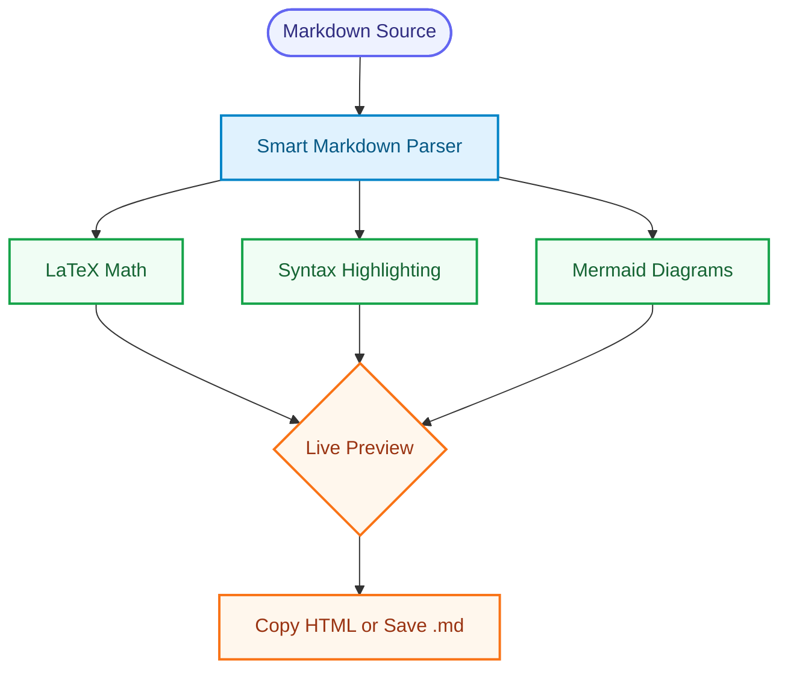

# Welcome to Lumina

Lumina is a Markdown editor for writing documents with live preview, LaTeX math, Mermaid diagrams, task lists, and Claude assistance.

## 1. Open, Edit, And Preview

Use **File > Open...** to open a `.md`, `.markdown`, or `.txt` file. Lumina remembers your last file and recent files from the File menu.

The left pane is the source editor. The right pane is the live preview. Use the header icons to show or hide:

- Source
- Terminal
- Claude

## 2. Mathematical Notation

Inline math uses single dollar signs, like $E = mc^2$.

Display math uses double dollar signs:

$$\frac{-b \pm \sqrt{b^2 - 4ac}}{2a}$$

Lumina also normalizes common LaTeX delimiters such as `\(...\)` and `\[...\]`.

## 3. Code Blocks

Syntax highlighting is applied automatically:

```javascript
function helloLumina() {
  console.log("Markdown, math, and diagrams in one place.");
}
```

## 4. Mermaid Diagrams

Flowcharts render directly in the preview:



## 5. Lists And Outlines

Simple ordered lists stay numeric:

1. Write the idea
2. Review the preview
3. Export or copy the result

Nested ordered lists render as an outline hierarchy:

1. Plan
   1. Define the thesis
   2. Gather evidence
      - Primary sources
      - Supporting notes
2. Draft
   1. Write the opening
   2. Refine the argument

In the editor:

- Press `Enter` to continue a list.
- Press `Tab` to indent a list item.
- Press `Shift+Tab` to outdent.
- Press `Enter` on an empty list item to exit the list.

## 6. Task Lists

Task lists render as clean checklists:

- [x] Draft the Markdown
- [x] Preview math and diagrams
- [ ] Share the finished document

## 7. Claude Pane

Open the Claude pane with the `C` button or **View > Show/Hide Claude**.

Claude opens against the current file's folder. Before Claude starts, Lumina saves the current editor buffer to the real file so Claude sees the latest text.

Useful Claude controls:

- **Send Context** sends the current file, cursor location, nearest heading, and selected text.
- **Prompt...** offers common prompts like improve writing, summarize, fix Markdown, explain math, and create outline.
- **Apply > Pull edited file** loads Claude's edited file back into Lumina.
- **Apply > Replace selection from clipboard** replaces the current selection with copied text.

## 8. Useful Menus

| Menu | What It Does |
| :--- | :--- |
| File | Open files, reopen recent files, download Markdown |
| Edit | Undo, redo, copy preview HTML |
| View | Toggle source, terminal, and Claude panes |
| Claude | Send context, use prompt presets, apply Claude edits |
| Help | Reopen this guide or contribute on GitHub |

Enjoy writing!
